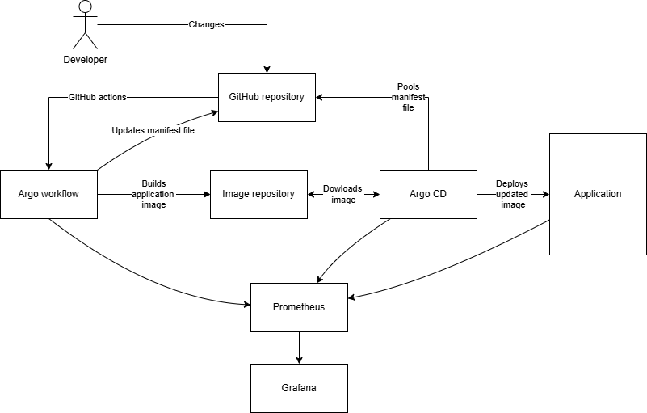
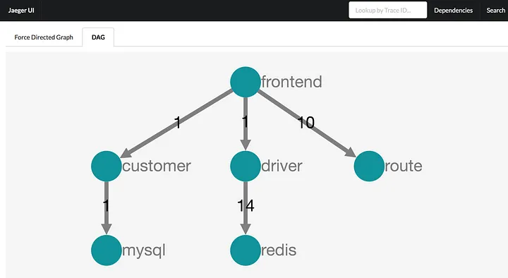

# Argo CD OTel

Argo CD OTel (OpenTelemetry) integration enables observability for Argo CD by
exporting metrics, traces the OpenTelemetry standard. The project is developed
as a part of Environment of Services Implementation course (Środowiska
udostępniania usług) at AGH University in Kraków at Faculty of Computer Science.

Year: 2024/2025, semester: summer, group 4.

## Authors

- [Piotr Kuchta](https://github.com/kpiotr6)
- [Jakub Sus](https://github.com/Suselkowy)
- [Jakub Szaredko](https://github.com/Szaroslav)
- [Jeremiasz Śliwiński](https://github.com/Jeremiej19)

## Table of Contents

1. [Introduction](#introduction)
2. [Technology Stack](#technology-stack)
3. [Case Study Concept](#case-study-concept)
4. [Architecture](#architecture)
5. [Environment Configuration](#environment-configuration)
6. [Installation](#installation)
7. [Reproduction](#reproduction)
8. [Demo Deployment](#demo-deployment)
9. [Using Artificial Intelligence](#using-artificial-intelligence)
10. [Summary](#summary)
11. [References](#references)

## Introduction

Argo CD is a declarative, GitOps continuous delivery tool for Kubernetes. It
follows the GitOps pattern of using Git repositories as the source of truth for
defining the desired application state. It can be configured by specifying
Kubernetes manifests in several ways e.g YAML/jsom manifests, kustomize
applications, helm charts or jsonnet files. Argo CD automates the deployment of
the desired application states in the specified target environments. Application
deployments can track updates to branches, tags, or be pinned to a specific
version of manifests at a Git commit. Argo CD is implemented as a Kubernetes
controller which continuously monitors running applications and compares the
current, live state against the desired target state (as specified in the Git
repo). A deployed application whose live state deviates from the target state is
considered OutOfSync. Argo CD reports & visualizes the differences, while
providing facilities to automatically or manually sync the live state back to
the desired target state. Any modifications made to the desired target state in
the Git repo can be automatically applied and reflected in the specified target
environments.

## Technology Stack

- Argo CD
- Kubernetes - is an open source system for automating deployment, scaling, and
   management of containerized applications.
- Minikube - is lightweight implementation of Kubernetes, installing simple
   cluster consiting of one node.
- Grafana - is a multi-platform open source analytics and interactive
   visualization web application. When connected to kubernetes allows for
   monitoring of deployed applications.
- Prometheus - is a free software application used for event monitoring
   and alerting. It records metrics in a time series database (allowing
   for high dimensionality) built using an HTTP pull model, with flexible
   queries and real-time alerting.

## Case Study Concept

This project's goal is to present simple application of Argo CD tool. It will be
used to deploy application [google-microservices-demo](https://github.com/agh-cs-imbeciles/google-microservices-demo)[^1]
forked from
[microservices-demo](https://github.com/GoogleCloudPlatform/microservices-demo)[^2],
which is web-based e-commerce solution. Apart from that, deployments of Grafana
and Prometheus will be used to monitor current metrics [exposed by Argo CD](https://argo-cd.readthedocs.io/en/latest/operator-manual/metrics/)[^3]
as well as e-commerce app itself. We will also apply Grafana tempo to gather traces
that will show us application performance. To control what is the desired state
of the application, Helm charts defined in
`google-microservices-demo/helm-chart/` will be incorporated. As some of metrics
changes are triggered by changes in demo application repository or Argo CD
configuration, we will create scripts to facilitate performing those updates.
Example scripts will:

- Initiate build of application from source code
- Upload image to repository
- Change and commit helm file to acknowledge new image.

We plan to test this project locally on minikube.

## Architecture

Deployment architecture



Architecture of jager example application "Hot R.O.D. - Rides on Demand"



## Environment configuration

### Necessary tools

Tools presented below should be installed before proceeding further:

1. [argocd CLI](https://argo-cd.readthedocs.io/en/stable/cli_installation/)[^4]
2. [helm CLI](https://helm.sh/docs/intro/install/)[^5]
3. [minikube](https://minikube.sigs.k8s.io/docs/start/?arch=%2Flinux%2Fx86-64%2Fstable%2Fbinary+download)[^6]

If you also plan on building google microservices demo application from scratch:

1. [docker](https://docs.docker.com/engine/install/)[^7]

### Argo cd applications

This project consists of many smaller configurable applications, deployed with Argo cd. Instructions for Argo cd on how to deploy them are stored in respective folders and files:

1. `argo/argo-cd/argo-app.yml` - google microservices demo application configuration.

2. `grafana/grafana-app.yml` - grafana configuration.

3. `prometheus/argo-prometheus.yaml` - prometheus configuration.

4. `tempo/tempo-app.yml` - grafana tempo configuration.

Below most important properties:
    - `server` - kubernetes server addresss argo and other applications are deployed on.
    - `repoURL` - repository containing application which argo cd actively observes in order to update demo application.
    - `targetRevision` - commit or branch argo cd currently tracks.

### Other configuration

1. `prometheus/config` and `prometheus/manifest` - folders containing files with other advanced properties for prometheus, separated from main file to improve redability.

2. `scripts/build_publish.sh` - script for building google microservices demo application images and pushing them to dockerhub.
    1. `BUILDPLATFORM` - target platform for build.
    2. `TAG` - tag to give particular build on dockerhub. It is argument of script.
    3. `REPO_PREFIX` - prefix of repository on dockerhub that images should be pushed to.

3. `app/helm-chart/Chart.yaml` - source of truth for Argo cd to deploy google microservices demo application.
    - `version` - current version of helm-chart.
    - `appVersion` - version of docker images to be used during deployment, should be the same as `TAG` in `scripts/build_publish.sh`.

4. `app/helm-chart/templates` - configuration specific for each microservice.

5. `app/helm-chart/values` - other configuration.

## Installation

### Essential Information

1. Argo CD admin dashboard credentials

    - Login: `admin`
    - Password: _see "Getting Argo CD initial admin password"_

2. Grafana admin dashboard credentials

    - Login: `admin`
    - Password: `admin`

3. Getting Argo CD initial admin password

    ```bash
    kubectl -n argocd get secret argocd-initial-admin-secret -o jsonpath="{.data.password}" | base64 -d
    ```

4. Getting Grafana initial admin password

    ```bash
    kubectl get secret monitoring-grafana -n argocd -o yaml
    ```

### Argo CD Setup

1. Create an Argo CD namespace

    ```bash
    kubectl create namespace argocd
    ```

2. Install preconfigured Argo CD

    ```bash
    kubectl apply -n argocd -f https://raw.githubusercontent.com/argoproj/argo-cd/stable/manifests/install.yaml
    ```

3. Port forward Argo CD dashboard server

    ```bash
    kubectl port-forward svc/argocd-server -n argocd 8080:443
    ```

### Grafana Setup

1. Install Grafana application

    ```bash
    kubectl apply -f grafana/grafana-app.yml
    ```

2. Port forward Grafana dashboard

    ```bash
    kubectl port-forward svc/grafana -n monitoring 3000:80
    ```

### Grafana Tempo Setup

```bash
kubectl apply -f tempo/tempo-app.yml
```

### Prometheus Setup

1. Run configured Prometheus (first you need to have Argo CD configured)

    ```bash
    kubectl apply -f prometheus/argo-prometheus.yaml
    ```

2. Port forward Prometheus (needed only for development)

    ```bash
    kubectl port-forward service/prometheus-operated -n monitoring 9090:9090
    ```

### Demo Application Setup

1. Run application

    ```bash
    kubectl apply -f argo/argo-cd/argo-app.yml
    ```

2. Port forward application ui

    ```bash
    kubectl port-forward svc/frontend -n demo-app 4000:80
    ```


## Reproduction

🚧

## Demo Deployment

This project was planned to be deployed only on a local minikube cluster. Instructions were provided in the previous sections.

## Using Artificial Intelligence

During development of this project we used various widely available LLM. We utilized them in following applications:

1. Solving problems and errors that occured during develpment - [GPT-4o (via ChatGPT)](https://openai.com/index/hello-gpt-4o/)[^8]
2. Inline code completion when developing configuration - [GitHub Copilot](https://github.com/features/copilot)[^9]
3. Generating some parts of documentation - [GPT-4o (via ChatGPT)](https://openai.com/index/hello-gpt-4o/)[^8]
4. Asking for the meaning of life, universe and how to deal with SUU induced depression - [GPT-4o (via ChatGPT)](https://openai.com/index/hello-gpt-4o/)[^8]

## Summary

We managed to deploy Argo CD with demo application, Grafana, Prometheus and Tempo. We also created scripts to build and publish images of demo application. Working with Argo CD was a great experience, as it allowed us to automate deployment of applications and monitor their state. We also learned how to use Grafana and Prometheus to visualize metrics and traces from our applications. The project was a good opportunity to learn about Kubernetes, GitOps, and observability tools.

## References

[^1]: https://github.com/agh-cs-imbeciles/google-microservices-demo
[^2]: https://github.com/GoogleCloudPlatform/microservices-demo
[^3]: https://argo-cd.readthedocs.io/en/latest/operator-manual/metrics/
[^4]: https://argo-cd.readthedocs.io/en/stable/cli_installation/
[^5]: https://helm.sh/docs/intro/install/
[^6]: https://minikube.sigs.k8s.io/docs/start/?arch=%2Flinux%2Fx86-64%2Fstable%2Fbinary+download
[^7]: https://docs.docker.com/engine/install/
[^8]: https://openai.com/index/hello-gpt-4o/
[^9]: https://github.com/features/copilot
