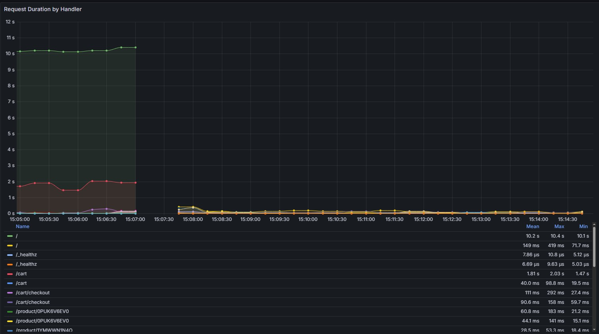

# Argo CD OTel

<!-- markdownlint-disable MD033 -->

Argo CD OTel (OpenTelemetry) integration enables observability for Argo CD by
exporting metrics, traces the OpenTelemetry standard. The project is developed
as a part of Environment of Services Implementation course (Środowiska
udostępniania usług)  at AGH University in Kraków at Faculty of Computer Science.

<!-- markdownlint-enable MD033 -->

Year: 2024/2025, semester: summer, group 4.

## Authors

- [Piotr Kuchta](https://github.com/kpiotr6)
- [Jakub Sus](https://github.com/Suselkowy)
- [Jakub Szaredko](https://github.com/Szaroslav)
- [Jeremiasz Śliwiński](https://github.com/Jeremiej19)

## Table of Contents

1. [Introduction](#introduction)
2. [Technology Stack](#technology-stack)
3. [Case Study Concept](#case-study-concept)
4. [Architecture](#architecture)
5. [Environment Configuration](#environment-configuration)
6. [Installation](#installation)
7. [Reproduction](#reproduction)
8. [Demo Deployment](#demo-deployment)
9. [Using Artificial Intelligence](#using-artificial-intelligence)
10. [Summary](#summary)
11. [References](#references)

## Introduction

[Argo CD](https://argoproj.github.io/cd/)[^1] is a declarative, GitOps
continuous delivery tool for [Kubernetes](https://kubernetes.io/)[^2]. It
follows the GitOps pattern of using [Git](https://git-scm.com/)[^3] repositories
as the source of truth for defining the desired application state. It can be
configured by specifying Kubernetes manifests in several ways e.g. YAML/JSON
manifests, kustomize applications,
[Helm charts](https://helm.sh/docs/topics/charts/)[^4] or
[Jsonnet files](https://jsonnet.org/)[^5]. Argo CD automates the deployment of
the desired application states in the specified target environments. Application
deployments can track updates to branches, tags, or be pinned to a specific
version of manifests at a Git commit. Argo CD is implemented as a Kubernetes
controller which continuously monitors running applications and compares the
current, live state against the desired target state (as specified in the Git
repo). A deployed application whose live state deviates from the target state is
considered OutOfSync. Argo CD reports & visualizes the differences, while
providing facilities to automatically or manually sync the live state back to
the desired target state. Any modifications made to the desired target state
in the Git repo can be automatically applied and reflected in the specified
target environments.

## Technology Stack

- Argo CD
- Kubernetes — is an open source system for automating deployment, scaling, and
  management of containerized applications.
- [Minikube](https://minikube.sigs.k8s.io/)[^6] — is lightweight implementation of
  Kubernetes, installing simple cluster consiting of one node.
- [Grafana](https://grafana.com/)[^7] — is a multi-platform open source analytics and interactive
  visualization web application. When connected to kubernetes allows for
  monitoring of deployed applications.
- [Grafana Tempo](https://grafana.com/oss/tempo/)[^8] — an open source, easy-to-use, and high-scale
  distributed tracing backend. Tempo is cost-efficient, requiring only object
  storage to operate, and is deeply integrated with Grafana.
- [Prometheus](https://prometheus.io/)[^9] — is a free software application used for event monitoring
  and alerting. It records metrics in a time series database (allowing
  for high dimensionality) built using an HTTP pull model, with flexible
  queries and real-time alerting.

## Case Study Concept

This project's goal is to present simple application of Argo CD tool. It will be
used to deploy application [`agh-cs-imbeciles/google-microservices-demo`](https://github.com/agh-cs-imbeciles/google-microservices-demo/)[^10]
forked from
[`GoogleCloudPlatform/microservices-demo`](https://github.com/GoogleCloudPlatform/microservices-demo)[^11],
which is web-based e-commerce solution. Apart from that, deployments of Grafana
and Prometheus will be used to monitor current [metrics exposed by Argo CD](https://argo-cd.readthedocs.io/en/latest/operator-manual/metrics/)[^12]
as well as e-commerce app itself. We will also apply Grafana Tempo to gather traces
that will show us application performance. To control what is the desired state
of the application, Helm charts defined in
`app/helm-chart/` will be incorporated. As some of metrics
changes are triggered by changes in demo application repository or Argo CD
configuration, we will create scripts to facilitate performing those updates.
Example scripts will:

- Initiate build of application from source code
- Upload image to repository
- Change and commit Helm file to acknowledge new image

We plan to test this project locally on Minikube.

## Architecture

Deployment architecture


Architecture of google microservices example application "Online Boutique"


## Environment configuration

### Necessary tools

Tools presented below should be installed before proceeding further:

1. [Argo CD CLI](https://argo-cd.readthedocs.io/en/stable/cli_installation/)[^13]
2. [Helm CLI](https://helm.sh/docs/intro/install/)[^14]
3. [Minikube](https://minikube.sigs.k8s.io/docs/start/)[^15]
4. If you also plan on building Google Microservices Demo Application from scratch:
   [Docker](https://docs.docker.com/engine/install/)[^16].

### Argo CD applications

This project consists of many smaller configurable applications, deployed with Argo CD. Instructions for Argo CD on how to deploy them are stored in respective folders and files:

1. `argo/argo-cd/argo-app.yml` – Google Microservices Demo Application configuration

2. `grafana/grafana-app.yml` – Grafana configuration

3. `prometheus/argo-prometheus.yaml` – Prometheus configuration.

4. `tempo/tempo-app.yml` – Grafana Tempo configuration.

Below most important properties: - `server` - kubernetes server addresss that Argo and other applications are deployed on. - `repoURL` - repository containing application which Argo CD actively observes in order to update demo application. - `targetRevision` - commit or branch Argo CD currently tracks.

### Other configuration

1. `prometheus/config` and `prometheus/manifest` - folders containing files with other advanced properties for prometheus, separated from main file to improve redability.

2. `scripts/build_publish.sh` - script for building google microservices demo application images and pushing them to dockerhub.

   1. `BUILDPLATFORM` - target platform for build.
   2. `TAG` - tag to give particular build on dockerhub. It is argument of script.
   3. `REPO_PREFIX` - prefix of repository on dockerhub that images should be pushed to.

3. `app/helm-chart/Chart.yaml` - source of truth for Argo CD to deploy google microservices demo application.

   - `version` - current version of `helm-chart`.
   - `appVersion` - version of docker images to be used during deployment, should be the same as `TAG` in `scripts/build_publish.sh`.

4. `app/helm-chart/templates` - configuration specific for each microservice.

5. `app/helm-chart/values` - other configuration.

## Installation

### Essential Information

1. Argo CD admin dashboard credentials

   - Login: `admin`
   - Password: _see "Getting Argo CD initial admin password"_

2. Grafana admin dashboard credentials

   - Login: `admin`
   - Password: `admin`

3. Getting Argo CD initial admin password

   ```bash
   kubectl -n argocd get secret argocd-initial-admin-secret -o jsonpath="{.data.password}" | base64 -d
   ```

### Argo CD Setup

1. Create an Argo CD namespace

   ```bash
   kubectl create namespace argocd
   ```

2. Install preconfigured Argo CD

   ```bash
   kubectl apply -n argocd -f https://raw.githubusercontent.com/argoproj/argo-cd/stable/manifests/install.yaml
   ```

3. Port forward Argo CD dashboard server

   ```bash
   kubectl port-forward svc/argocd-server -n argocd 8080:443
   ```

### Grafana Setup

1. Install Grafana application

   ```bash
   kubectl apply -f grafana/grafana-app.yml
   ```

2. Port forward Grafana dashboard

   ```bash
   kubectl port-forward svc/grafana -n monitoring 3000:80
   ```

### Grafana Tempo Setup

```bash
kubectl apply -f tempo/tempo-app.yml
```

### Prometheus Setup

1. Run configured Prometheus (first you need to have Argo CD configured)

   ```bash
   kubectl apply -f prometheus/argo-prometheus.yaml
   ```

2. Port forward Prometheus (needed only for development)

   ```bash
   kubectl port-forward service/prometheus-operated -n monitoring 9090:9090
   ```

### Demo Application Setup

1. Run application

   ```bash
   kubectl apply -f argo/argo-cd/argo-app.yml
   ```

2. _(Optional)_ If you are using `minikube` you need to enable `minikube tunnel`
   to turn on the load balancer found in the application.

3. _(Optional)_ Port forward application UI frontend

   ```bash
   kubectl port-forward svc/frontend -n demo-app 4000:80
   ```

### Building and Changing Demo Application Images
1. Change the `REPO_PREFIX` variable in `scripts/build_publish.sh` to your Docker Hub repository prefix, e.g. `kpiotr6`.

2. Change the `BUILDPLATFORM` variable in `scripts/build_publish.sh` to your target platform, e.g. `linux/amd64`.

3. Make sure you are logged in to Docker Hub:

   ```bash
   docker login
   ```

4. Build and publish demo application images

   ```bash
   ./scripts/build_publish.sh <TAG>
   ```

   where `<TAG>` is the tag you want to use for the images, e.g. `v1.1.0`.

5. Update Helm chart with new image version:

   ```bash
   sed -i 's/appVersion: .*/appVersion: <TAG>/' app/helm-chart/Chart.yaml
   ```
   where `<TAG>` is the tag you used in the previous step, e.g. `v1.1.0`. You can also do this manually by editing `app/helm-chart/Chart.yaml` file.

6. Commit the changes to the repository:

   ```bash
   git add app/helm-chart/Chart.yaml
   git commit -m "Update app version to <TAG>"
   git push origin main
   ```

7. Sync Argo CD to apply the changes:

   ```bash
   argocd app sync demo-app
   ```
   or you can do it manually via Argo CD dashboard by clicking on the "Sync" button for the `demo-app` application.

8. After a few minutes, the new version of the application should be fully deployed and visible in the Argo CD dashboard.

## Reproduction

To test argocd setup, just change image app version in Chart.yaml. After about 3 minutes or manual sync new pods should be set up. We prepared two images "v1.1.0" nad "v1.1.1". Change is visable in grafana dashboard -> "v1.1.1" have artificial delay implemented on frontend. On left site of picture image "v1.1.1" with delays, on right "v1.1.0" without 

## Demo Deployment

This project was planned to be deployed only on a local Minikube cluster. Instructions were provided in the previous sections.

## Using Artificial Intelligence

During development of this project we used various widely available LLM. We utilized them in following applications:

1. Solving problems and errors that occured during develpment - [GPT-4o (via ChatGPT)](https://openai.com/index/hello-gpt-4o/)[^17]
2. Inline code completion when developing configuration - [GitHub Copilot](https://github.com/features/copilot)[^18]
3. Generating some parts of documentation - GPT-4o (via ChatGPT)
4. Asking for the meaning of life, universe and how to deal with SUU induced depression - GPT-4o (via ChatGPT)
5. Help generating Grafana dashboards and app metrics - VS Code copilot with Claude 3.5

## Summary

We managed to deploy Argo CD with demo application, Grafana, Prometheus and Tempo. We also created scripts to build and publish images of demo application. Working with Argo CD was a great experience, as it allowed us to automate deployment of applications and monitor their state. We also learned how to use Grafana and Prometheus to visualize metrics and traces from our applications. The project was a good opportunity to learn about Kubernetes, GitOps, and observability tools.

## References

[^1]: Argo CD
[^2]: Kubernetes
[^3]: Git
[^4]: Helm charts
[^5]: Jsonnet
[^6]: Minikube
[^7]: Grafana
[^8]: Grafana Tempo
[^9]: Prometheus
[^10]: Our Google Microservices Demo
[^11]: Google Microservices Demo
[^12]: Argo CD metrics
[^13]: Argo CD CLI installation
[^14]: Helm CLI installation
[^15]: Minikube installation
[^16]: Docker installation
[^17]: GPT-4o
[^18]: GitHub Copilot
